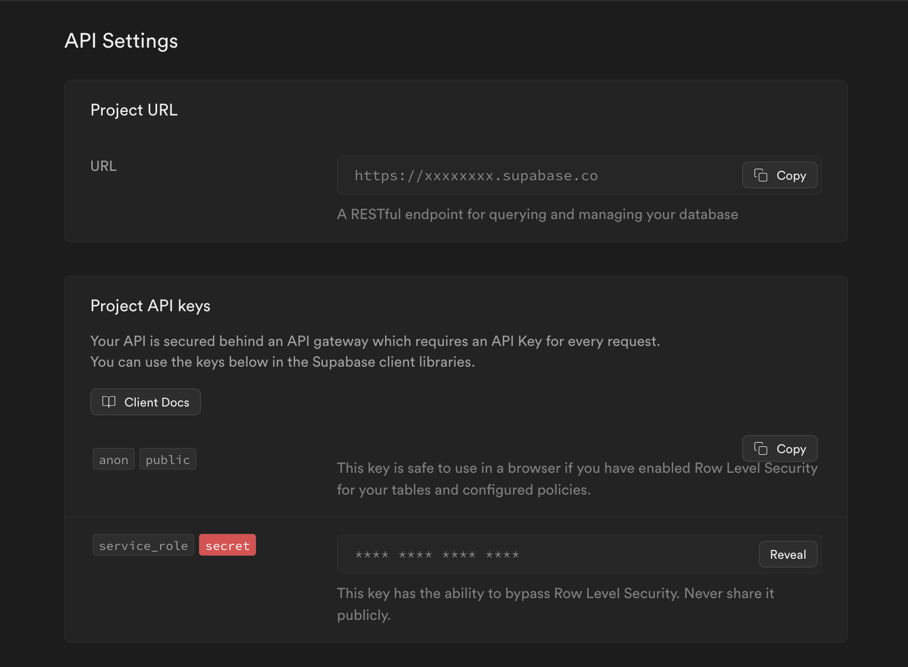
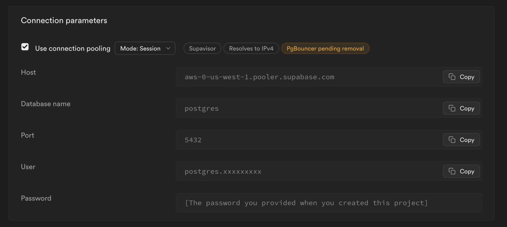

[Supabase](https://supabase.com) is an open source Firebase alternative that provides a managed, highly scalable PostgreSQL database and other infrastructure APIs that can support stateless and serverless applications. Supabase is easy to connect to using either the Supabase API, or standard PostgreSQL connection parameters.

You can view an example of this integration on [Github](https://github.com/khulnasoft/khulnasoft-deploy-integration/tree/main/codex-json/supabase)

## Setting up Supabase

If you don't have one already, you will first need to create an organization and project in Supabase to use with Khulnasoft Cloud. If you are just testing Supabase with Khulnasoft, you can create a free personal organization to start. For more details, see the [Supabase Docs](https://supabase.com/docs)

If you plan to connect using PostgreSQL connection parameters, make sure that you save your Database password at creation time since you may need it to connect. 

## Connecting using the Supabase API or Clients

The simplest way to connect to Supabase is via the API or one of Supabase's client libraries. Connecting via the API also lets you use Supabase's advanced realtime and streaming features. 

To connect using the API: 

* From your Supabase Project Dashboard, navigate to **Project Settings**, then **API**
* In the API Settings pane, copy the Project URL and Secret Service Role key

* Go to the Khulnasoft Dashboard for your project, and navigate to Secrets. Create the following Secrets in the `Prod` environment: 
  * `SUPABASE_URL`: the Project URL for your Supabase DB
  * `SUPABASE_KEY`: the secret Service Role Key

:::info
 If you want to use your Database locally or in a preview environment, you can also set these environment variables for the `dev` and `preview` environment
:::


When you deploy your application, Codex will automatically set these secrets as env variables in your environment. You can use these environment variables when configuring your Supabase client. 

For example, if you are connecting from a Python app, you can do something like the following to connect with the Supabase Python client: 

```python
from supabase import create_client, Client

url: str = os.getenv('SUPABASE_URL')
key: str = os.getenv('SUPABASE_KEY')

supabase: Client = create_client(url, key)
```

## Connecting via PostgreSQL Connection Parameters

You can also connect to your database using the standard PostgreSQL Database connection parameters. This is useful if your project cannot use the Supabase API, or if it requires a standard PostgreSQL connection

To connect via PostgreSQL:

* From your Supabase Project Dashboard, navigate to Project Settings, then Database.
* In the Connection Parameters Settings, copy values needed for connection. Your database password will be the password you set when creating your project. 


* Go to the Khulnasoft Dashboard for your project, and navigate to Secrets. Create the following Secrets in the `Prod` environment: 
  * `POSTGRES_HOST`: Your PostgreSQL Host
  * `POSTGRES_PORT`: Your PostgreSQL DB Port
  * `POSTGRES_USER`: Your PostgreSQL Username
  * `POSTGRES_PASSWORD`: Your PostgreSQL Database Password


 
When you deploy your application, Codex will automatically set these secrets as env variables in your environment. You can use these environment variables when configuring your PostgreSQL client or connection.  