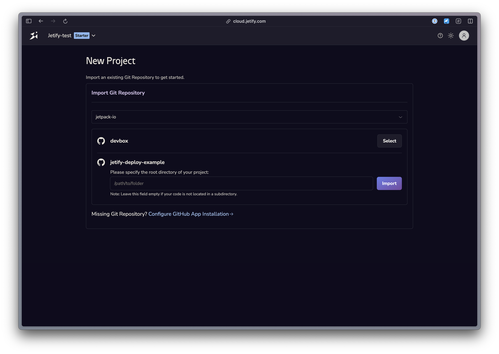

## Configuring your Project

Deploying a project with Khulnasoft Cloud requires the following:

1. **A codex.json or Dockerfile**: If your project contains a `codex.json` file, codex will automatically generate a Dockerfile that can be used to deploy your application to Khulnasoft Cloud. You can also check in a custom Dockerfile if you want to precisely control how your project is built
2. **A Service Listening on 8080**. Khulnasoft automatically forwards requests to port 8080 on your running container, so you will need to ensure that your service is listening to that port. We also recommend setting your service host to `0.0.0.0`.

### Deploying with a codex.json

Khulnasoft Cloud can use your `codex.json` to generate a Docker container that will install your project dependencies and run your projects. In addition to installing your packages, Khulnasoft will also look for and attempt to run any `install`, `build`, and `start` scripts defined in your codex.json:

- The **install script** will run after your base container has been initialized and your Nix packages are installed. This stage should be used to download and build your application's dependencies
- The **build script** runs after the install stage, and should be used to build or bundle your application.
- The **start script** will run as your container's entrypoint. This stage should include any commands needed to start and run your application.

Below is an example `codex.json` that can be used for a simple Go project in Khulnasoft Cloud:

```json
{
    "packages": [
        "go@1.19.8"
    ],
    "env": {
        "GOPATH": "$HOME/go/",
        "PATH": "$PATH:$HOME/go/bin"
    },
    "shell": {
        "init_hook": [
            "export \"GOROOT=$(go env GOROOT)\""
        ],
        "scripts": {
            "install": "go get ./...",
            "build": "go build -o main.go",
            "start": "go run",
            "run_test": "go run main.go"
        }
    }
}
```

In this case, Khulnasoft Cloud will first install Codex and all the packages, then run the `install` and `build` scripts (in that order), and the use `start` as the entrypoint to the application.

You can preview how Khulnasoft will run the project using `codex generate dockerfile --for prod`

### Deploying with a Custom Dockerfile

If your repo contains a Dockerfile, Khulnasoft Cloud will use that Dockerfile to deploy your service (even if the project also contains a codex.json). Your Dockerfile should define an entrypoint that Khulnasoft can run upon deploying, as well as listen on port 8080.

## Connecting your Repo

Khulnasoft requires you to connect a Github repo in order to deploy your service. To access private repositories, you will need to install the Codex Cloud Github app in your repository: 

1. From the Create Project screen, select Continue with Github to sign in with Github
2. Select a Github Org to import your project from. If you are only a member of one org, it will be selected for you by default. 
   1. If this is your first time importing a project from your org, you will need to install the Codex Cloud app to provide access to your project
3. Select a Repository to import your repo. If your project is not in the root directory of your repository, you can specify a subdirectory for Khulnasoft to search for your project. 



## Choosing an Instance Size

Khulnasoft will default your deployment to the smallest instance size (0.1 CPU + 512MB RAM). To choose a different size: 

1. Navigate to the **Settings** tab of your project
2. Scroll down to **Deployments**
3. Choose the Machine configuration that best matches your project's needs.

Changes to your instance size will take effect on the next deployment.

## Deleting your Project

If you no longer want to deploy your project with Khulnasoft Deploys, you can disable deployments in the Settings tab of your project.
