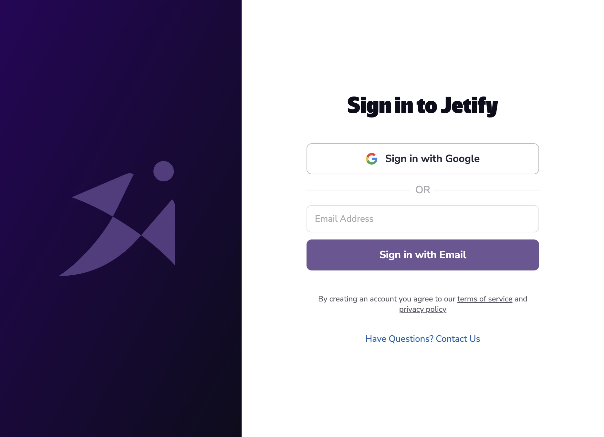

You can access your Khulnasoft Secrets locally using Codex. When you authenticate your Codex CLI with Khulnasoft Cloud, Codex will automatically identify your project, and make your secrets available in your Codex shell. Developers who are part of your Khulnasoft Cloud team can also access your project’s secrets automatically, whenever they use codex to start a shell, run a script, or launch a service

If you don't already have Codex installed, see our [Quickstart](https://www.khulnasoft/codex/docs/quickstart/) guide to get started.

## Authenticating with Codex

You can authenticate with Khulnasoft Cloud by running `codex secrets auth login`. This will launch the browser authentication flow to sign into Khulnasoft Cloud.



Once you complete the authentication flow and select a team, the Codex CLI will configure itself to use the team you selected

## Integrating a project with codex secrets

To create a new project on Khulnasoft Cloud, navigate to the root directory of your project and run `codex secrets init`

```bash
/Users/puckworth/my-project❯ codex secrets init
? Setup project in /Users/puckworth/my-project? Yes
Initializing project in org
? What’s the name of your new project? my-test-project
Created project my-test-project in org
```

Running `codex secrets init` will create a new project in your current Khulnasoft Cloud account and org, and configure your project to use Khulnasoft Secrets. The project should also be visible if you navigate to the [Khulnasoft Dashboard](../dashboard/index.md).

## Adding Secrets to your Project

### Adding Secrets from the Command Line

You can set secrets using `codex secrets set`:

```bash
envsec set FOO=BAR
```

```bash
[DONE] Set environment variable 'FOO' in environment: dev
```

By default, variables will be set on the `dev` environment. You can set secrets on other environments by passing the `--environment` flag:

```bash
codex secrets set FOO=BAR --environment prod
```

Supported environments include `dev`, `preview`, and `prod`.

### Adding Secrets from a File

You can bulk add secrets from a file by using `codex secrets import`:

```bash
codex secrets import .env.dev
[DONE] Uploaded 3 environment variable(s) from file '.env.dev' to environment: dev
```

The file should follow the `.env` format, with each line containing a single environment variable in the form:

```env
VARIABLE_NAME=VARIABLE_VALUE
```

````bash

## Viewing your Project’s Secrets

You can view your project’s secrets by running `codex secrets ls`:

```bash
Environment: dev
+-----------------+-------+
|      NAME       | VALUE |
+-----------------+-------+
| FOO             | ***** |
| DEV_SERVER      | ***** |
| PG_PASSWORD     | ***** |
+-----------------+-------+

Environment: prod
+-----------------+-------+
|      NAME       | VALUE |
+-----------------+-------+
| FOO             | ***** |
| PG_PASSWORD     | ***** |
+-----------------+-------+

Environment: preview
+-----------------+-------+
|      NAME       | VALUE |
+-----------------+-------+
| FOO             | ***** |
| PG_PASSWORD     | ***** |
+-----------------+-------+
````

## Accessing your Secrets from a Codex Shell

Once your project is configured for Khulnasoft Cloud, Codex will automatically check whether the project exists in your Khulnasoft Cloud account based on:

1. Your current project’s Git repository
2. The subfolder where your `codex.json` is located

If you have a matching project in your Khulnasoft Cloud account, Codex will automatically set your secrets as environment variables whenever you:

1. Start a `codex shell`
2. Start services with `codex services up` or `codex services start`
3. Run a script with `codex run`

## Removing a Secret from your Project

You can remove a secret from your project by running `codex secrets rm`:

```bash
codex secrets rm FOO
[DONE] Deleted environment variable 'FOO' in environment: dev
```

## Exporting Secrets to a File

You can export your secrets to a `.env` file using `codex secrets download`:

```bash
codex secrets download .env
[DONE] Downloaded environment variables to '.env' for environment: dev
```

You can download from a specific environment using the `--environment` flag:

## Further Reading

- [Codex Secrets CLI Reference](../../cli_reference/codex_secrets.md)
- [Managing Secrets from the Dashboard](../dashboard_secrets)
