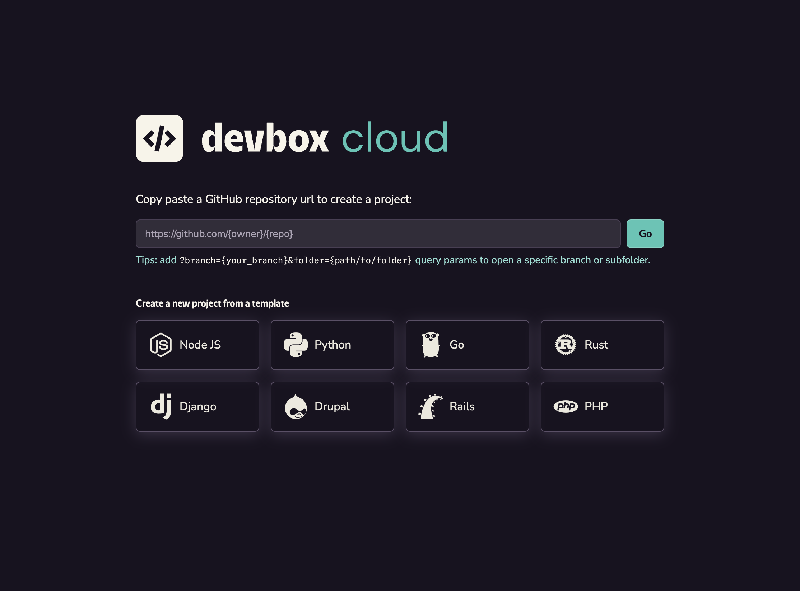
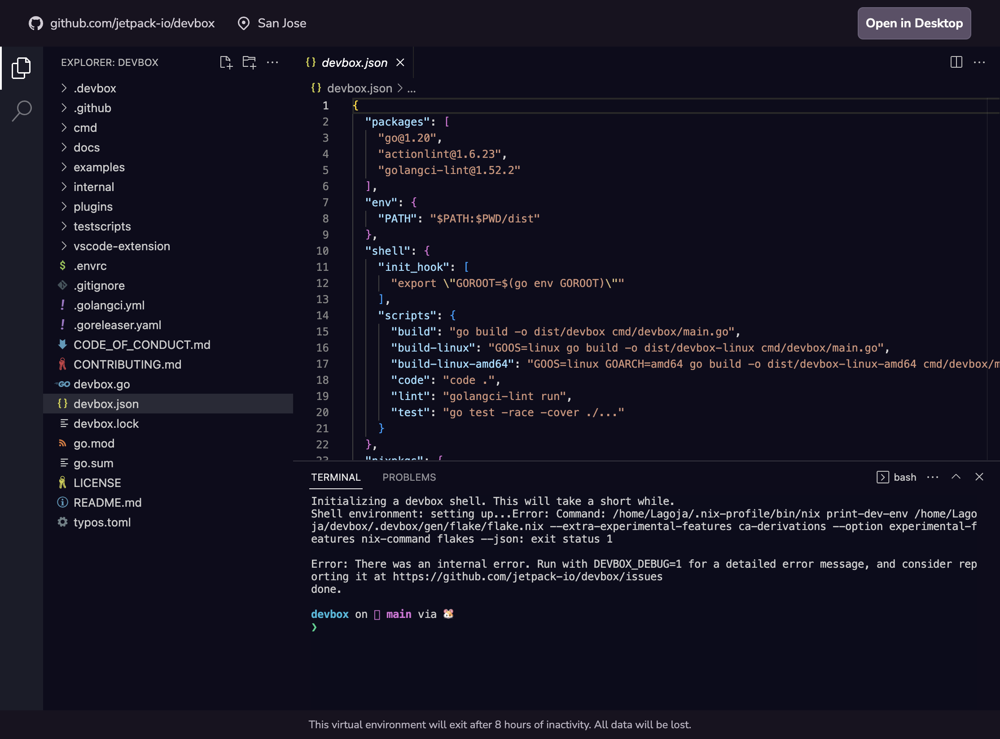

Codex.khulnasoft.com provides a sandboxed playground environment for you to learn how Codex works, try out example projects or templates, and experiment with using Codex with your own projects.

<figure className="text--center">

[](https://codex.khulnasoft.com)

<figcaption> Launch a Codex playground at <a href="https://codex.khulnasoft.com"> codex.khulnasoft.com</a> </figcaption>
</figure>

## Quickstart

You can launch a new playground from your browser by visiting [codex.khulnasoft.com](https://codex.khulnasoft.com), or click the button below to launch a quickstart shell:

[](https://codex.khulnasoft.com/new)

Each Codex playground comes with the Codex CLI, Nix, and several common packages preinstalled, so you can easily run projects that include a `codex.json`



### Open a GitHub Repository in codex.khulnasoft.com

:::note
If you are trying to open a private repository on Codex.khulnasoft.com, we may ask you to install the [**Khulnasoft Cloud app**](https://github.com/apps/khulnasoft-cloud) from the Github Marketplace. This grants permissions to clone your repositories to the cloud VMs
:::

1. Navigate to the Github Repo that you want to preview on Codex.khulnasoft.com
2. Copy the URL, and prepend it with `https://codex.khulnasoft.com/`.
    1. For example, to open the Codex repo, you would enter [https://codex.khulnasoft.com/github.com/khulnasoft/codex](http://codex.khulnasoft.com/github.com/khulnasoft/codex).
    1. You can also enter the URL on [codex.khulnasoft.com](https://codex.khulnasoft.com) and click the `Go` button
3. Follow the prompts to sign in with your Github Account.
4. Your project should now launch in a terminal session in your browser
    1. If the project has a `codex.json` in the root directory, then Codex will automatically install your packages and launch you into a codex shell.
    2. If the project does not have a `codex.json`, a blank one will be automatically created using `codex init`. You can add packages to the VM using `codex add`.

### Opening a Specific Branch

You can open a specific branch of your project using the `branch` query parameter. This is useful when you want to preview a PR or WIP changes for your project.

For example: https://codex.khulnasoft.com/github.com/org/repo?branch=staging would clone the `staging` branch of your project, and open it in your Cloud Shell.

### Opening a Subfolder

You can open a specific a subfolder of your project using the `folder` query parameter. This can be useful when working with a monorepo where your project's `codex.json` lives in a subfolder.

For example: https://codex.khulnasoft.com/github.com/khulnasoft/codex?folder=examples/development/ruby will start your terminal in the Ruby example in the Codex repo, load the configuration from the `codex.json` in that folder, and then start a Codex shell.

### Accessing a Port

To access any non-privileged port, simply append `/port/<port_number>` to the project url. For example, the following url opens up port 8080 on the VM:

```
https://codex.khulnasoft.com/app/projects/<projectId>/port/8080
```

This URL redirects to `<hostname>-<port>.svc.codex.khulnasoft.com`, which points to the actual host and port of your project's VM machine.

### Opening in Desktop VS Code

Click on the `Open in Desktop` button on the top right corner, which will open up your local VS Code editor. Follow the prompt, and you should see the VS Code window refreshes and connects to the remote machine via ssh.

### Add Codex Playground to your Project's README

If your project uses Codex, you can make it easy for developers to test your project in a Codex playground by adding the `Open in Codex.khulnasoft.com` badge to your repo

[](https://codex.khulnasoft.com/github.com/khulnasoft/codex)

Add the following code to your README.md:

```md
[](https://codex.khulnasoft.com/{path_to_repo})
```

## More Info

You can learn more about using Codex playgrounds in our **[FAQ](beta_faq.md)**.
